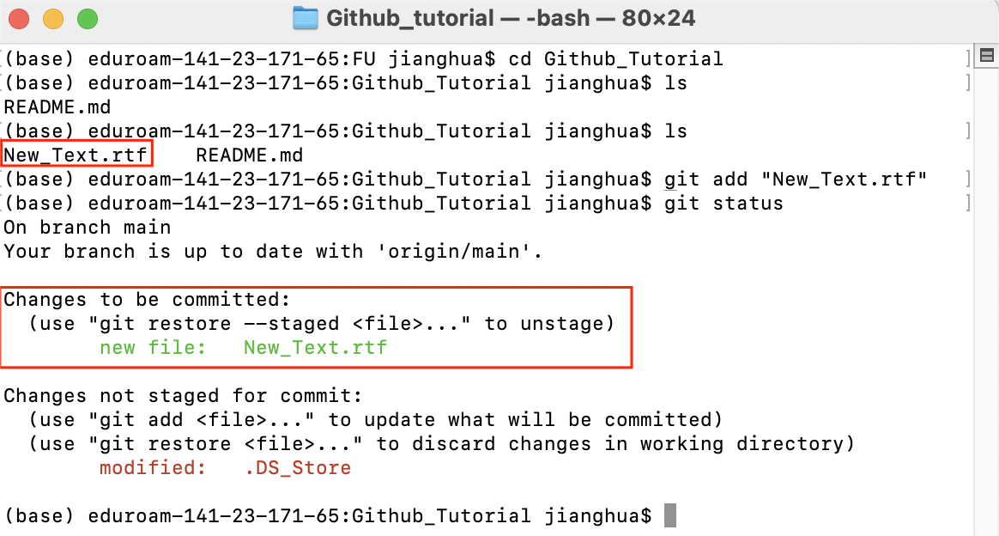

# Chapter 1. Setting up the Git
## 1.1 Install Git
Git is a free and open source distributed version control system designed to handle everything from small to very large projects with speed and efficiency. Git could be downloaded in different operatinng systems.

* **_MacOS_**
  - Method 1: using Homebrew
    + Step 1: Download the Homebrew from its [Git Official Website](https://www.git-scm.com/downloads).
      > executing the command **`brew --version`** on terminal to verify whether the homebrew is succefully installed. Once the installation succeeds, the terminal will output the current version number.

      <p align="center">
      
      </p>
      
    + Step 2: Open the terminal and then type the command **`brew install git`** to install git
  
  - Method 2: using Binary Installar
    + Step 1: Download the binary file on the [Git Official Website](https://www.git-scm.com/downloads).
    + Step 2: Click the binary file and follow the instructions
    + Step 3: Open the terminal and upgrade the git by typing the command **`git clone https://github.com/git/git`**

* **_Windows_**
  - the most used method: using Standalone Installer
    + Step 1: Choose the [correct version](https://www.git-scm.com/download/win), normally it's the 64-bit version.

    <p align="center">
    
    </p>

    + Step 2: Click on the downloaded file to start the installation. Proceed with the default settings until the installation is complete.
    + Step 3: Right-click your mouse in empty area, and you'll see a new _"Git Bash"_ option in the menu.

* **_Linux_**
  - Take Ubuntu as an example, more details about installation on other unix systems can be found on [Git Official Website](https://www.git-scm.com/downloads).
    + Step 1: Open the command line window  and execute **`apt-get install git`**

      <p align='center'>
      
      </p>

> [!NOTE]
> 1. After installation, one can verify using **`git --version`** on the terminal or cmd. With displaying the version number of git, the installation is well done.
    <p align='center'>
    
    </p>
> 2. Actually, I haven't personally tested it on Windows and Linux, but most online tutorials suggest a similar approach, so it should be fine.

## 1.2 Create a Github Account
- Step 1: Use email to register on the [Github Official Website](https://github.com/)
- Step 2: click on the profile icon at the upper right corner of the webpage you'll see the menu
- Step 3: click on the _"Your Profile"_ to view the information. The interface is similar when viewing someone else's profile page.

  <p align='center'>
  
  </p>

## 1.3 Configure Git
- **_Basic Setup_**
  
  configure the name and email to create connection between the local machine and the Github by type the following code on terminal or cmd
  ```
  git config --global user.name "Your Github account's name"
  git config --global user.email "Your Github account's email"
  git config --list 
  ```
- **_Create Personal Access Token(PAT)_**

  It could be considered as password and sometimes is required when transporting changes between the local machines and the Github
  > more details could be found on the [PAT](https://docs.github.com/en/authentication/keeping-your-account-and-data-secure/managing-your-personal-access-tokens)

  + Step 1: Click on the profile icon on the upper right corner of the webpage
  + Step 2: Sequentially click on the _"Settings"_ -\> _"Developer settings"_ -\> _"Tokens(classic)"_
  + Step 3: Follow the instructions to create PAT

  <p align='center'>
    
    
    
  </p>
  
## 1.4 Overview of the command-line vs. web interface usage

- **_Advantages_**
  
  + **command-line**
    
    * Full control over Git operations
    * Faster and more efficient for experienced users
    * Can be scripted for automation
      
  + **web interface usage**
    
    * User-friendly, visual interface
    * Easy to manage repositories, issues, and pull requests
    * Integrated with other GitHub services like Actions and Pages
      
- **_Common Command_**
  > [Git Command](https://git-scm.com/docs/git-add) gives a more detailed description
  + First most used command `git add "file name"` - Add file contents to the index
    
    * **Command-Line**

      <p align='center'>
      
      </p>

      First, create a new file, for example, _"New_Text.rtf"_ (shown in the first red box), and then you can add it using `git add`. After adding you can see the added file     is ready to be commited(shown in the second red box). In fact, any changes can be added, such as modifications to an existing file or the deletion.

    * **Web Interface**

      <p align='center'>
      
      
      </p>
      
      Adding files via the web interface is more straightforward. First, navigate to the folder where you want to add files, and then click _"Add files"_(shown in the upper right corner of the left image). At this point, you can choose to upload files (either one by one or by dragging and dropping multiple files simultaneously). The uploaded files will appear below the upload area(shown in the red box of the right image).

  + Second most used command `git commit -m "message"` - Record changes to the repository

    * **Command-Line**

      <p align='center'>
      
      </p>

      After adding the changes, you can use `git commit` to confirm them. In my case, I simply record the change of adding a new file by using the `git commit -m "add new_text"`. After this commit, the changes is recorded in the local repository.
      
      Leave a good message can always help you recall what changes were recorded in this step later. Since the commit operation can be tracked, the value in the red box is the commit ID.

    * **Web Interface**

      <p align='center'>
      
      </p>

      Committing changes on the website is also straightforward. After making changes to the repository (e.g., adding a photo in my case), write a message in the message box, and finally click _"Commit changes."_ After that, the changes are recorded on the Github Repository.

  + Third Operation `git rm "file"` - Remove files from the working tree and from the index

    * **Command-Line**
      
      <p>
      
      
      </p>
      
      
      Sometimes you may want to delete a file that has been wrongly committed. In such cases, you can use the command `git rm --cached 'file'`. This command will remove the file from the index area without affecting the file in your working directory (local). After executing this command, you'll notice that the status of the deleted file changes back to "untracked"(in the second red box of the left image), indicating that Git no longer tracks this file. Then, you can commit to record this deletion(shown in the right image).
      
    * **Web Interface**

      <p>
      
       
      </p>

      Deleting files using the web interface is also straightforward (though this typically deletes files from the working directory). First, select the file you want to delete. Then, click the menu button in the upper right corner of the left image. From the dropdown menu, select _"delete file."_ Finally, click _"commit changes"_ of the right image and confirm the action to complete the deletion.

  + Pull and Push
    * **Pull**

      When changes occur in the remote repository, you can use a pull request to synchronize these changes with your local repository.
   
      <p>
        
        
      </p>

      - Step 1: use `git remote -v` to check the remote repositories connected to your local repository.
      - Step 2: use `git fetch origin <branch name>` to fetch the changes from the remote repository to the local one.
        > the branch name is located in the
        
        <p align='center'>
          
        </p>      

      - Step 3: use `git merge origin/<branch name>` to perform the merge.

    * **Push**

      When changes occur in the local repository, you can use a push request to synchronize these changes with your remote repository.

      <p>
        
        
      </p>

      Compared to the _pull_ operation, _push_ is simpler. You can use `git push -u origin <branch name>`.

      However, it is important to note that before performing a push operation (or more accurately, before making changes to the local repository), it's better to use pull to synchronize the remote repository's changes with your local repository first. From the red boxes from left to right images, you can see that the local changes have been synchronized to the remote repository.
